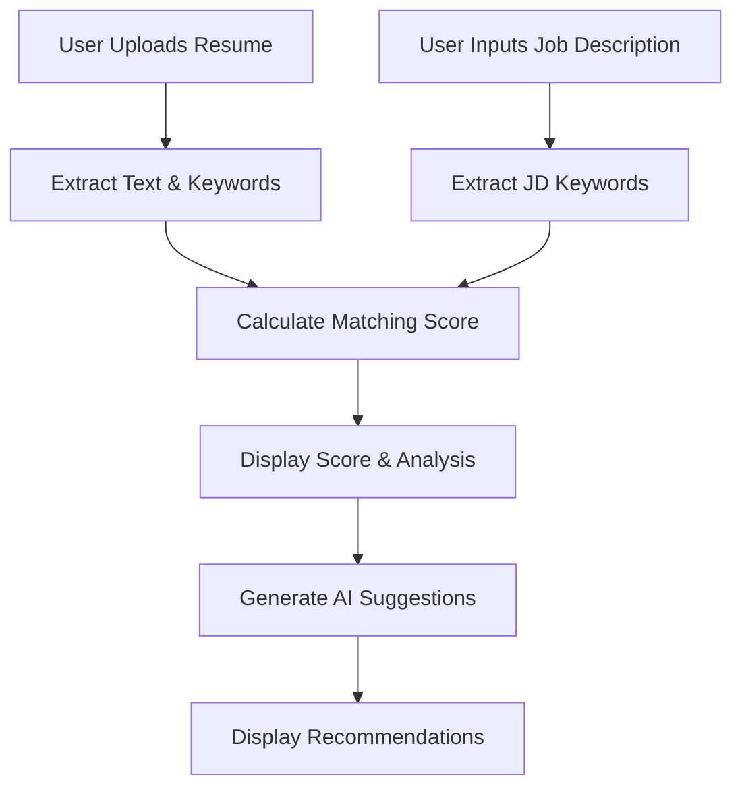

Resume Doctor.Ai - Project Summary
Resume Doctor.Ai is an AI-powered web application that analyzes resumes against job descriptions to provide intelligent optimization suggestions and compatibility scores.

🎯 Core Functionality
Resume Upload: Drag & drop PDF/DOC/DOCX files with automatic text extraction
Job Description Analysis: NLP-powered keyword extraction and processing
AI Matching: Jaccard similarity algorithm calculates compatibility scores
Smart Suggestions: Basic and premium AI-generated recommendations for resume improvement
🏗️ Architecture
Backend: Flask REST API with SQLite database
Frontend: Vanilla HTML/CSS/JavaScript with responsive design
AI/NLP: spaCy, NLTK, scikit-learn for keyword extraction and analysis
Authentication: JWT-based user management
🔄 Workflow
User uploads resume → text extraction & keyword analysis
User inputs job description → NLP processing
System calculates matching score using advanced algorithms
AI generates personalized suggestions to improve compatibility
Dashboard displays results with actionable recommendations
🚀 Key Features
Real-time dashboard with integrated workflow
Multi-dimensional keyword analysis (technical, soft skills, industry terms)
Color-coded score visualization
Professional UI with mobile-responsive design
Comprehensive API with proper error handling# 🏥 Resume Doctor.Ai

**AI-Powered Resume Optimization Platform**

Resume Doctor.Ai is a comprehensive web application that uses advanced AI and NLP technologies to analyze resumes against job descriptions, providing intelligent suggestions to improve job matching scores.

## 🌟 Key Features

- **Smart Resume Upload**: Drag & drop PDF/DOC/DOCX files with automatic text extraction
- **Job Description Analysis**: Intelligent keyword extraction and analysis
- **AI-Powered Matching**: Advanced algorithm calculates compatibility scores
- **Intelligent Suggestions**: Basic and Premium AI-generated recommendations
- **Real-time Dashboard**: Integrated workflow with instant feedback
- **Professional UI**: Clean, responsive design with professional color scheme

## 🏗️ Architecture Overview

```
Resume-Doctor-AI/
├── backend/          # Flask API server with AI services
├── frontend/         # HTML/CSS/JavaScript client
├── database/         # SQLite database and models
└── docs/            # Comprehensive documentation
```

## 🚀 Technology Stack

### Backend
- **Framework**: Flask (Python)
- **Authentication**: JWT (Flask-JWT-Extended)
- **Database**: SQLite with SQLAlchemy ORM
- **AI/NLP**: spaCy, NLTK, scikit-learn
- **File Processing**: PyPDF2, python-docx

### Frontend
- **Languages**: HTML5, CSS3, JavaScript (ES6+)
- **Styling**: Custom CSS with Grid/Flexbox
- **Features**: Drag & Drop, Real-time updates, Responsive design

### Database
- **Type**: SQLite (development), PostgreSQL ready (production)
- **ORM**: SQLAlchemy with Flask-SQLAlchemy
- **Models**: User, Resume, JobDescription, MatchScore, ResumeSuggestion

## 📊 Core Workflow



## 🔧 Quick Start

### Prerequisites
- Python 3.8+
- pip package manager

### Installation

1. **Clone & Navigate**
   ```bash
   cd Resume-Doctor-AI
   ```

2. **Setup Backend**
   ```bash
   cd backend
   pip install -r requirements.txt
   python init_database.py
   python app_fixed.py
   ```

3. **Access Application**
   - Open `frontend/us10_dashboard.html` in browser
   - Login with: `test@resumedoctor.ai` / `password123`

## 🎯 Core Features

### 1. Resume Analysis
- **File Support**: PDF, DOC, DOCX (up to 10MB)
- **Text Extraction**: Advanced parsing with error handling
- **Keyword Extraction**: Technical skills, soft skills, industry terms
- **Auto-Processing**: Immediate analysis upon upload

### 2. Job Description Processing
- **Smart Input**: Rich text editor with validation
- **Keyword Analysis**: NLP-powered extraction
- **Context Understanding**: Industry and role-specific analysis
- **Real-time Feedback**: Instant keyword count and validation

### 3. AI Matching Algorithm
- **Jaccard Similarity**: Advanced set-based comparison
- **Multi-dimensional Analysis**: Technical, soft skills, industry terms
- **Weighted Scoring**: Priority-based keyword importance
- **Visual Feedback**: Color-coded score indicators

### 4. Intelligent Suggestions

#### Basic Suggestions
- Missing technical skills identification
- Soft skills gap analysis
- Industry keyword recommendations
- Priority-based action items

#### Premium Suggestions
- Critical gap analysis with urgency indicators
- Contextual advice based on job requirements
- Quantification recommendations
- Skill development roadmaps
- Resume structure optimization

## 📈 AI Technology Deep Dive

### Keyword Extraction Engine
- **spaCy NLP**: Named entity recognition and POS tagging
- **NLTK**: Advanced tokenization and stemming
- **TF-IDF**: Statistical keyword importance
- **Custom Patterns**: Industry-specific term recognition

### Suggestion Generation
- **Context Analysis**: Job description importance scoring
- **Gap Identification**: Missing vs. extra keyword analysis
- **Priority Classification**: Critical, high, medium, low urgency
- **Action Generation**: Specific, actionable recommendations

### Matching Algorithm
```python
# Simplified matching logic
jaccard_score = len(intersection) / len(union)
weighted_score = (technical_score * 0.5) + (soft_skills * 0.3) + (other * 0.2)
final_score = (jaccard_score + weighted_score) / 2 * 100
```

## 🔗 API Endpoints

### Authentication
- `POST /api/login` - User authentication
- `POST /api/register` - User registration

### Resume Management
- `POST /api/upload_resume` - Upload and process resume
- `GET /api/resumes` - List user resumes
- `GET /api/resumes/<id>` - Get specific resume

### Job Description Management
- `POST /api/upload_jd` - Save job description
- `GET /api/job_descriptions` - List user JDs
- `GET /api/job_descriptions/<id>` - Get specific JD

### Analysis & Suggestions
- `POST /api/calculate_match` - Calculate matching score
- `POST /api/basic_suggestions` - Generate basic suggestions
- `POST /api/premium_suggestions` - Generate premium suggestions

## 📁 Project Structure

```
Resume-Doctor-AI/
├── backend/
│   ├── app_fixed.py              # Main Flask application
│   ├── models.py                 # Database models
│   ├── config.py                 # Configuration settings
│   ├── routes/                   # API route handlers
│   │   ├── us05_upload_routes.py # Resume upload endpoints
│   │   ├── us05_jd_routes.py     # Job description endpoints
│   │   ├── us06_matching_routes.py # Matching algorithm endpoints
│   │   └── us07_suggestions_routes.py # AI suggestions endpoints
│   ├── services/                 # Business logic services
│   │   ├── keyword_parser.py     # Keyword extraction service
│   │   ├── matching_service.py   # Score calculation service
│   │   └── dynamic_suggestions_service.py # AI suggestions service
│   └── middleware/               # Authentication & security
├── frontend/
│   ├── us10_dashboard.html       # Main dashboard interface
│   ├── us10_login.html          # Authentication pages
│   ├── us10_account.html        # User account management
│   └── static/
│       ├── css/us10_styles.css  # Comprehensive styling
│       └── js/us10_dashboard.js # Dashboard functionality
├── database/
│   ├── models.py                # Database schema definitions
│   └── dr_resume_dev.db        # SQLite database file
└── docs/                       # Detailed documentation
```

## 🔒 Security Features

- **JWT Authentication**: Secure token-based authentication
- **File Validation**: Type and size restrictions
- **Input Sanitization**: XSS and injection prevention
- **CORS Configuration**: Cross-origin request security
- **Error Handling**: Secure error messages

## 🎨 UI/UX Features

- **Professional Design**: Clean, modern interface
- **Responsive Layout**: Mobile and desktop optimized
- **Real-time Feedback**: Instant visual updates
- **Loading Indicators**: User-friendly progress feedback
- **Color-coded Results**: Intuitive score visualization
- **Drag & Drop**: Modern file upload experience

## 📊 Performance Metrics

- **File Processing**: < 2 seconds for typical resumes
- **Keyword Extraction**: < 1 second for job descriptions
- **Matching Calculation**: < 500ms for score generation
- **Suggestion Generation**: < 3 seconds for premium suggestions

## 🔄 Integration Flow

1. **User Authentication** → JWT token generation
2. **File Upload** → Text extraction → Keyword analysis
3. **Job Description Input** → NLP processing → Keyword extraction
4. **Matching Calculation** → Multi-dimensional scoring
5. **Suggestion Generation** → AI-powered recommendations
6. **Dashboard Display** → Real-time updates and feedback

## 📚 Documentation

### Complete Documentation Suite
- **[Backend Documentation](docs/BACKEND.md)** - Flask API, AI services, NLP pipeline, and architecture
- **[Frontend Documentation](docs/FRONTEND.md)** - HTML/CSS/JS components, dashboard workflow, and UI interactions
- **[Database Documentation](docs/DATABASE.md)** - SQLite schema, relationships, and data flow
- **[API Documentation](docs/API.md)** - Complete REST API reference with examples

### Architecture Diagrams
- **System Architecture** - Complete component overview and integration
- **Dashboard Workflow** - User journey from upload to suggestions
- **AI Suggestion Process** - Detailed NLP and suggestion generation flow
- **Keyword Extraction Pipeline** - spaCy, NLTK, and TF-IDF processing

### Key Integration Points
- **Frontend ↔ Backend**: JWT authentication, REST API calls, real-time updates
- **Backend ↔ AI Services**: Keyword extraction, matching algorithms, suggestion generation
- **AI ↔ Database**: Persistent storage of analysis results and user data
- **Complete Workflow**: Upload → Extract → Match → Suggest → Display

## 🚀 Deployment

Ready for production deployment with:
- Environment-based configuration
- Database migration scripts
- Docker containerization support
- Cloud platform compatibility (AWS, Azure, GCP)

## 📞 Support

For technical support or feature requests, please refer to the detailed documentation in the `docs/` directory.

---

**Resume Doctor.Ai** - Transforming resumes with AI-powered intelligence.
