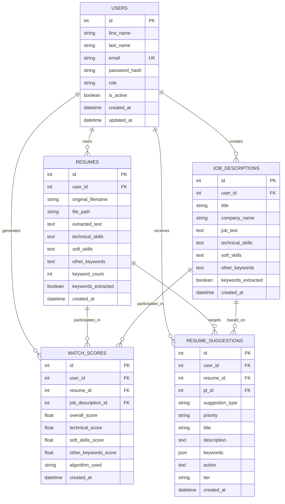

# 🗄️ Database Documentation

## Overview

Resume Doctor.Ai uses a relational database design with SQLite for development and PostgreSQL-ready schema for production. The database stores user data, resumes, job descriptions, matching scores, and AI-generated suggestions.

## 🏗️ Database Architecture

```
Database Schema:
├── users                    # User accounts and authentication
├── resumes                  # Resume files and extracted content
├── job_descriptions         # Job postings and requirements
├── match_scores            # Compatibility analysis results
└── resume_suggestions      # AI-generated recommendations
```

## 📊 Entity Relationship Diagram



## 📋 Table Specifications

### 1. Users Table
**Purpose**: Store user account information and authentication data

```sql
CREATE TABLE users (
    id INTEGER PRIMARY KEY AUTOINCREMENT,
    first_name VARCHAR(100) NOT NULL,
    last_name VARCHAR(100) NOT NULL,
    email VARCHAR(255) UNIQUE NOT NULL,
    password_hash VARCHAR(255) NOT NULL,
    role VARCHAR(50) DEFAULT 'basic',
    is_active BOOLEAN DEFAULT TRUE,
    last_login DATETIME,
    created_at DATETIME DEFAULT CURRENT_TIMESTAMP,
    updated_at DATETIME DEFAULT CURRENT_TIMESTAMP
);

-- Indexes
CREATE INDEX idx_users_email ON users(email);
CREATE INDEX idx_users_active ON users(is_active);
```

**Fields Description**:
- `id`: Primary key, auto-increment
- `first_name`, `last_name`: User's full name
- `email`: Unique identifier for login (indexed)
- `password_hash`: Bcrypt hashed password
- `role`: User tier ('basic', 'premium', 'admin')
- `is_active`: Account status flag
- `last_login`: Track user activity
- `created_at`, `updated_at`: Audit timestamps

**Storage**: ~500 bytes per user

### 2. Resumes Table
**Purpose**: Store uploaded resume files and extracted content

```sql
CREATE TABLE resumes (
    id INTEGER PRIMARY KEY AUTOINCREMENT,
    user_id INTEGER NOT NULL,
    original_filename VARCHAR(255) NOT NULL,
    file_path VARCHAR(500) NOT NULL,
    file_size INTEGER NOT NULL,
    file_type VARCHAR(10) NOT NULL,
    extracted_text TEXT,
    technical_skills TEXT,
    soft_skills TEXT,
    other_keywords TEXT,
    keyword_count INTEGER DEFAULT 0,
    keywords_extracted BOOLEAN DEFAULT FALSE,
    title VARCHAR(255),
    is_active BOOLEAN DEFAULT TRUE,
    upload_status VARCHAR(20) DEFAULT 'processing',
    error_message TEXT,
    created_at DATETIME DEFAULT CURRENT_TIMESTAMP,
    updated_at DATETIME DEFAULT CURRENT_TIMESTAMP,
    FOREIGN KEY (user_id) REFERENCES users(id) ON DELETE CASCADE
);

-- Indexes
CREATE INDEX idx_resumes_user ON resumes(user_id, is_active);
CREATE INDEX idx_resumes_status ON resumes(upload_status);
CREATE INDEX idx_resumes_keywords ON resumes(keywords_extracted);
```

**Fields Description**:
- `id`: Primary key
- `user_id`: Foreign key to users table
- `original_filename`: Original file name from upload
- `file_path`: Server storage path
- `file_size`, `file_type`: File metadata
- `extracted_text`: Full text content from PDF/DOC
- `technical_skills`: JSON array of technical keywords
- `soft_skills`: JSON array of soft skill keywords
- `other_keywords`: JSON array of other important terms
- `keyword_count`: Total extracted keywords
- `keywords_extracted`: Processing status flag
- `upload_status`: 'processing', 'completed', 'failed'

**Storage**: ~2-50KB per resume (varies by content size)

### 3. Job Descriptions Table
**Purpose**: Store job postings and extracted requirements

```sql
CREATE TABLE job_descriptions (
    id INTEGER PRIMARY KEY AUTOINCREMENT,
    user_id INTEGER NOT NULL,
    title VARCHAR(255) NOT NULL,
    company_name VARCHAR(255),
    job_text TEXT NOT NULL,
    technical_skills TEXT,
    soft_skills TEXT,
    other_keywords TEXT,
    keyword_count INTEGER DEFAULT 0,
    keywords_extracted BOOLEAN DEFAULT FALSE,
    is_active BOOLEAN DEFAULT TRUE,
    word_count INTEGER DEFAULT 0,
    character_count INTEGER DEFAULT 0,
    created_at DATETIME DEFAULT CURRENT_TIMESTAMP,
    updated_at DATETIME DEFAULT CURRENT_TIMESTAMP,
    FOREIGN KEY (user_id) REFERENCES users(id) ON DELETE CASCADE
);

-- Indexes
CREATE INDEX idx_jd_user ON job_descriptions(user_id, is_active);
CREATE INDEX idx_jd_keywords ON job_descriptions(keywords_extracted);
CREATE INDEX idx_jd_title ON job_descriptions(title);
```

**Fields Description**:
- `title`: Job position title
- `company_name`: Employer name (optional)
- `job_text`: Full job description content
- `technical_skills`, `soft_skills`, `other_keywords`: Extracted keywords (JSON)
- `word_count`, `character_count`: Content statistics

**Storage**: ~1-10KB per job description

### 4. Match Scores Table
**Purpose**: Store compatibility analysis results

```sql
CREATE TABLE match_scores (
    id INTEGER PRIMARY KEY AUTOINCREMENT,
    user_id INTEGER NOT NULL,
    resume_id INTEGER NOT NULL,
    job_description_id INTEGER NOT NULL,
    overall_score FLOAT NOT NULL,
    technical_score FLOAT DEFAULT 0.0,
    soft_skills_score FLOAT DEFAULT 0.0,
    other_keywords_score FLOAT DEFAULT 0.0,
    total_resume_keywords INTEGER DEFAULT 0,
    total_jd_keywords INTEGER DEFAULT 0,
    matched_keywords INTEGER DEFAULT 0,
    algorithm_used VARCHAR(50) DEFAULT 'jaccard',
    is_active BOOLEAN DEFAULT TRUE,
    created_at DATETIME DEFAULT CURRENT_TIMESTAMP,
    updated_at DATETIME DEFAULT CURRENT_TIMESTAMP,
    FOREIGN KEY (user_id) REFERENCES users(id) ON DELETE CASCADE,
    FOREIGN KEY (resume_id) REFERENCES resumes(id) ON DELETE CASCADE,
    FOREIGN KEY (job_description_id) REFERENCES job_descriptions(id) ON DELETE CASCADE
);

-- Indexes
CREATE INDEX idx_match_user_date ON match_scores(user_id, created_at);
CREATE INDEX idx_match_resume ON match_scores(resume_id);
CREATE INDEX idx_match_jd ON match_scores(job_description_id);
CREATE INDEX idx_match_score ON match_scores(overall_score);
```

**Fields Description**:
- `overall_score`: Final compatibility percentage (0-100)
- `technical_score`, `soft_skills_score`, `other_keywords_score`: Category scores
- `total_resume_keywords`, `total_jd_keywords`: Keyword counts
- `matched_keywords`: Number of overlapping keywords
- `algorithm_used`: Scoring algorithm identifier

**Storage**: ~200 bytes per match score

### 5. Resume Suggestions Table
**Purpose**: Store AI-generated improvement recommendations

```sql
CREATE TABLE resume_suggestions (
    id INTEGER PRIMARY KEY AUTOINCREMENT,
    user_id INTEGER NOT NULL,
    resume_id INTEGER NOT NULL,
    jd_id INTEGER NOT NULL,
    suggestion_type VARCHAR(50) NOT NULL,
    priority VARCHAR(20) NOT NULL,
    title VARCHAR(255) NOT NULL,
    description TEXT NOT NULL,
    keywords JSON,
    action TEXT,
    examples JSON,
    tier VARCHAR(20) DEFAULT 'basic',
    is_premium BOOLEAN DEFAULT FALSE,
    implemented BOOLEAN DEFAULT FALSE,
    implementation_notes TEXT,
    created_at DATETIME DEFAULT CURRENT_TIMESTAMP,
    updated_at DATETIME DEFAULT CURRENT_TIMESTAMP,
    FOREIGN KEY (user_id) REFERENCES users(id) ON DELETE CASCADE,
    FOREIGN KEY (resume_id) REFERENCES resumes(id) ON DELETE CASCADE,
    FOREIGN KEY (jd_id) REFERENCES job_descriptions(id) ON DELETE CASCADE
);

-- Indexes
CREATE INDEX idx_suggestions_user ON resume_suggestions(user_id, created_at);
CREATE INDEX idx_suggestions_resume ON resume_suggestions(resume_id);
CREATE INDEX idx_suggestions_type ON resume_suggestions(suggestion_type);
CREATE INDEX idx_suggestions_priority ON resume_suggestions(priority);
CREATE INDEX idx_suggestions_tier ON resume_suggestions(tier);
```

**Fields Description**:
- `suggestion_type`: Category ('technical', 'soft_skills', 'formatting', etc.)
- `priority`: Urgency level ('critical', 'high', 'medium', 'low')
- `title`: Brief suggestion headline
- `description`: Detailed explanation
- `keywords`: Related keywords (JSON array)
- `action`: Specific action to take
- `examples`: Usage examples (JSON array)
- `tier`: 'basic' or 'premium'
- `implemented`: User tracking flag

**Storage**: ~1-5KB per suggestion

## 🔄 Data Flow

### 1. User Registration Flow
```sql
-- Create new user
INSERT INTO users (first_name, last_name, email, password_hash)
VALUES ('John', 'Doe', 'john@example.com', '$2b$12$...');

-- Verify unique email constraint
SELECT COUNT(*) FROM users WHERE email = 'john@example.com';
```

### 2. Resume Upload Flow
```sql
-- Insert resume record
INSERT INTO resumes (user_id, original_filename, file_path, file_size, file_type)
VALUES (1, 'resume.pdf', '/uploads/user1/resume_123.pdf', 245760, 'pdf');

-- Update with extracted content
UPDATE resumes 
SET extracted_text = '...', 
    technical_skills = '["Python", "React", "SQL"]',
    soft_skills = '["Leadership", "Communication"]',
    other_keywords = '["Agile", "Scrum"]',
    keyword_count = 15,
    keywords_extracted = TRUE,
    upload_status = 'completed'
WHERE id = 123;
```

### 3. Matching Score Calculation
```sql
-- Calculate and store match score
INSERT INTO match_scores (
    user_id, resume_id, job_description_id,
    overall_score, technical_score, soft_skills_score, other_keywords_score,
    total_resume_keywords, total_jd_keywords, matched_keywords
) VALUES (1, 123, 456, 78.5, 85.2, 72.1, 68.9, 45, 38, 28);
```

### 4. Suggestion Generation
```sql
-- Store AI suggestions
INSERT INTO resume_suggestions (
    user_id, resume_id, jd_id, suggestion_type, priority,
    title, description, keywords, action, tier
) VALUES (
    1, 123, 456, 'technical', 'high',
    'Add Docker Experience',
    'The job description emphasizes containerization skills...',
    '["Docker", "Kubernetes", "Containers"]',
    'Add Docker to Skills section and describe a project using it',
    'basic'
);
```

## 📊 Data Analytics Queries

### User Activity Analytics
```sql
-- Active users in last 30 days
SELECT COUNT(DISTINCT user_id) as active_users
FROM resumes 
WHERE created_at >= datetime('now', '-30 days');

-- Average resumes per user
SELECT AVG(resume_count) as avg_resumes_per_user
FROM (
    SELECT user_id, COUNT(*) as resume_count
    FROM resumes
    WHERE is_active = TRUE
    GROUP BY user_id
);
```

### Performance Analytics
```sql
-- Average matching scores by category
SELECT 
    AVG(overall_score) as avg_overall,
    AVG(technical_score) as avg_technical,
    AVG(soft_skills_score) as avg_soft_skills
FROM match_scores
WHERE created_at >= datetime('now', '-7 days');

-- Most common suggestion types
SELECT 
    suggestion_type,
    COUNT(*) as count,
    AVG(CASE WHEN implemented = TRUE THEN 1 ELSE 0 END) as implementation_rate
FROM resume_suggestions
GROUP BY suggestion_type
ORDER BY count DESC;
```

### Storage Analytics
```sql
-- Database size analysis
SELECT 
    'users' as table_name,
    COUNT(*) as record_count,
    AVG(LENGTH(first_name) + LENGTH(last_name) + LENGTH(email)) as avg_size
FROM users
UNION ALL
SELECT 
    'resumes',
    COUNT(*),
    AVG(LENGTH(extracted_text) + LENGTH(technical_skills) + LENGTH(soft_skills))
FROM resumes;
```

## 🔧 Database Maintenance

### Backup Strategy
```sql
-- SQLite backup
.backup main backup_YYYYMMDD.db

-- PostgreSQL backup
pg_dump resume_doctor_ai > backup_YYYYMMDD.sql
```

### Data Cleanup
```sql
-- Archive old match scores (older than 6 months)
UPDATE match_scores 
SET is_active = FALSE 
WHERE created_at < datetime('now', '-6 months');

-- Clean up failed uploads
DELETE FROM resumes 
WHERE upload_status = 'failed' 
AND created_at < datetime('now', '-7 days');
```

### Performance Optimization
```sql
-- Analyze query performance
EXPLAIN QUERY PLAN 
SELECT * FROM match_scores 
WHERE user_id = 1 
ORDER BY created_at DESC 
LIMIT 10;

-- Rebuild indexes
REINDEX;

-- Update table statistics
ANALYZE;
```

## 🔒 Security Considerations

### Data Protection
- **Password Hashing**: Bcrypt with salt rounds
- **PII Encryption**: Sensitive data encryption at rest
- **Access Control**: Row-level security for multi-tenant data
- **Audit Logging**: Track data access and modifications

### Backup Security
```sql
-- Encrypted backups
gpg --cipher-algo AES256 --compress-algo 1 --symmetric backup.sql

-- Secure file permissions
chmod 600 backup_encrypted.sql.gpg
```

## 📈 Scaling Considerations

### Horizontal Scaling
- **Read Replicas**: Separate read/write operations
- **Sharding**: Partition by user_id for large datasets
- **Caching**: Redis for frequently accessed data

### Vertical Scaling
- **Connection Pooling**: Optimize database connections
- **Query Optimization**: Index tuning and query analysis
- **Storage Optimization**: Compress large text fields

### Migration to PostgreSQL
```sql
-- PostgreSQL-specific optimizations
CREATE INDEX CONCURRENTLY idx_resumes_gin_keywords 
ON resumes USING gin(to_tsvector('english', extracted_text));

-- Full-text search
SELECT * FROM resumes 
WHERE to_tsvector('english', extracted_text) @@ to_tsquery('python & react');
```

---

This database design provides a robust foundation for Resume Doctor.Ai with optimized performance, comprehensive analytics capabilities, and scalability for future growth.
